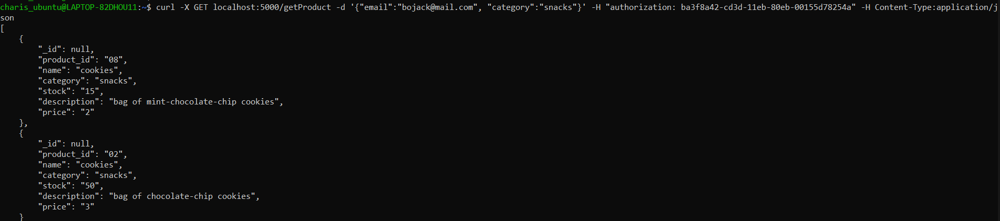
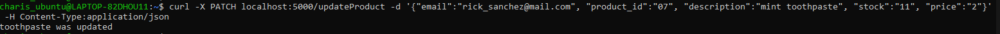

<h1>Ergasia2_e18011_Charis_Antoniadi</h1>
This project is about executing queries for a Mongodb database, using the pymongo module of python. The app2.py file contains thirteen endpoints, each used for the POST, GET, PATCH and DELETE HTTP methods.

<h2>Containerization</h2>

<p>Firstly we need to open a terminal window to start docker</p>

```bash
    sudo dockerd
```

<p>To start the containerization process (creation of the flask container and mongodb container), while the docker is still running and every other container has stopped executing (necessary in case the same ports were being used), we type the command bellow in the terminal window:</p>

```bash
    sudo docker-compose up -d
```

<p>Output:</p>


     
<p>In order for the command to work successfully, a dockerfile and a docker-compose.yml file have to be already created. Both of the files can be found bellow alongside with a brief explanation of the main/most important commands.</p>

```dockerfile   
    FROM ubuntu:16.04 
    RUN apt-get update 
    RUN apt-get install -y python3 python3-dev python3-pip
    # installing the dependencies
    RUN pip3 install flask pymongo
    RUN mkdir /app
    RUN mkdir -p /app/data
    COPY app2.py /app/app2.py
    ADD data /app/data
    # specifying the port that the flask service will use
    EXPOSE 5000
    WORKDIR /app
    ENTRYPOINT ["python3","-u","app2.py"]
```

```yaml
    version: '2'
    services:
        mongodb:    #mongodb service
            image: mongo
            restart: always #policy in case the container crushes
            container_name: mongodb
            ports:  #specifying the ports that will be used for the mongodb service
            - 27017:27017
            volumes:    #data maintenance (data is saved in the subdirectory mongodb of current directory)
            - ./mongodb/data:/data/db
        flask-service:  #flask service
            build:  #building the flask container
                context: ./flask    #the dockerfile is located in the subdirectory flask of the current directory
            restart: always #policy in case the container crushes
            container_name: flask
            depends_on: #the flask service can start only if mongodb is up
                - mongodb
            ports:  #specifying the ports that will be used for the flask service
                - 5000:5000
            environment:    #specifying the access point to mongodb for the flask service
                - "MONGO_HOSTNAME=mongodb"
```

<p>If we want to copy existing data to the database we can type the commands bellow in a terminal window</p>

```bash
    sudo docker cp users.json mongodb:/users.json
    sudo docker exec -it mongodb mongoimport --db=DSMarkets --collection=Users --file=users.json --jsonArray
    sudo docker cp products.json mongodb:/products.json
    sudo docker exec -it mongodb mongoimport --db=DSMarkets --collection=Products --file=products.json --jsonArray
```

<em>note: If the json files aren't located in the default path, we use the cd command in order to relocate to the directory where the json files are located.</em>

<p>When we are ready to run the project, we use the command python3 followed by the file name, as seen below.</p>

```bash
    python3 app2.py
```

<em>note: If the app2.py file isn't located in the default path, we use the cd command in order to relocate to the directory where the file is located.</em>

<h2>Execution</h2></br>

<h3 style="font-weight: bold">Create User Admin and Create User Customer (POST)</h3>
<p style="text-align: justify">In order to execute all the endpoints, we have to create a users, which will be added to the Users collection. Since there are two categories that a user could belong to, there also two "Create User" functions/endpoints. The first one is called createUserAdmin and as its name suggest, it is used for the initialization of an admin user in the database. The other function is called createUserCustomer and it is used for the creation of a customer user in the database. In order to work, both of the endpoints have to take as input the email, the name and the desired password of the user. To execute the endpoint, in a new terminal window we can type one of the commands bellow, depending on the user's category:</p>

```bash
curl -X POST localhost:5000/createUserAdmin -d '{"email":"insert email here", "name":"insert name here", "password":"insert password here"}' -H Content-Type:application/json
curl -X POST localhost:5000/createUserCustomer -d '{"email":"insert email here", "name":"insert name here", "password":"insert password here"}' -H Content-Type:application/json
```
<p>Because there are two endpoints dedicated to the creation of a user, depending on their user's category, the user's category will be added automatically to the database, based on the name of the endpoint as we can see in the snippets of code bellow.</p>

```python
     users.update_one({"email":data['email']}, 
                {"$set":
                     {
                        "category":'admin'
                    }
                })

    users.update_one({"email":data['email']}, 
                {"$set":
                    {
                        "category":'customer'
                    }
                })
```

<p>The result if there is no other entry in the collection with the given email, will be a success response as seen in the image bellow.</p>


<p>In case the given username already exist, the output will be a corresponding response.</p>

<h3 style="font-weight: bold">Login (POST)</h3>
<p>Now, the customer user needs to be logged in, if they want to be able to execute any of the following endpoints. This will happen by typing the command:</p>

```bash
curl -X POST localhost:5000/login -d '{"email":"insert email here", "password":"insert password here"}' -H Content-Type:application/json
```

<p>If the login information is correct then a success message followed by the user's session uuid and email address will show up.</p>

</br>

<h3 style="font-weight: bold">Get Product (GET)</h3>
<p>To print the information of a product, based on the product's id, name or category, we use the command:</p>

```bash
curl -X GET localhost:5000/getProduct -d '{"email":"insert email here", "product_id":"insert the id of the product" or "name":"insert the name of the product" or "category":"insert the category of the product"}' -H "authorization: the user's uuid (printed in the terminal after the successful execution of the login query)" -H Content-Type:application/json
```
<p>The result should look like the image bellow, based on the type of search that the user made.</p>




<p style="text-align:justify">The email of the user executing the query must match with an email in the database, in order to proceed. Also the user's uuid has to be valid. Since only a customer could execute this query, a condition should be applied for checking wether user belongs to the 'customer' category or the 'admin' category. If the necessary conditions return a true value then another check is being made, to find out the kind of key the user typed in their request (product_id, name or category). In case the user requested to see the item with a specific product_id, the a search through the database occurs, followed by a check to find out if such product exists in the database. If the request is correct, then the product's info should appear on the screen. In case the request contained the key 'name'*, again a search through the database is necessary to check if there are actually products with that name. When the search returns the products that have that name, the result will be assigned to 'iterable'. As 'iterable' may store many products that have to be returned as output, a list ('product_list') is declared, to be used later for storing every product dictionary, the name-search could find. In the third case, when the user chooses to type the 'category' key, all the products that belong to that exact category should be printed in ascending order based on their price. That is the reason why a bubble sort is implemented to the products_list (list that contains all the products of the category). In any other case, there will be a corresponding response depending on the problem the program faced, while processing the user's request.</p>

<em style="text-align:justify">*Since many products in the collection can have the same name and it's only necessary to have different product id's, a sort isn't implemented because it wouldn't change the outcome (printing every product and its info, that has the same name as the one given by the user.</em>

```python
    #Finding a user with the given email
    user = users.find_one({"email":data['email']})

    #Checking if user exists
    if user != None:
        #Checking if user is a customer
        if user['category'] == "customer":
            #Passing user's uuid to variable uuid
            uuid = request.headers.get('authorization')
            #Calling function is_session_valid with parameter uuid and passing its return value to variable authentication
            authentication = is_session_valid(uuid)
            #Authentication failed
            if (authentication == False):
                #Error response
                return Response("Authentication Failed\n", status=401, mimetype='application/json')
            #Authentication successful
            else:
                #Searching by product_id
                if "product_id" in data:
                    #Finding a product with the given product_id
                    product = products.find_one({"product_id":{"$eq":data['product_id']}})
                    #Checking if product exists
                    if product == None:
                        #Response if no product was found
                        return Response("No product with that id was found.\n", mimetype='application/json')
                    #There is a product in the database with that id
                    else:
                        product['_id'] = None
                        #Response if query executed successfully
                        return Response(json.dumps(product), status=200, mimetype='application/json')
                #Searching by name
                elif "name" in data:
                    #Checking if there are products in the db with the given name
                    if (products.find({"name":{"$eq":data['name']}}).count() == 0):
                        #Response if no product was found
                        return Response("No product with that name was found.\n", mimetype='application/json')
                    #There is at least one product in the database with that name
                    else:
                        #Assigning to iterable all of the products with value of key 'name' equal to the product's name given by the user
                        iterable = products.find({"name":{"$eq":data['name']}})
                        #Declaring empty list to be filled with products
                        products_list = []
                        #Iterating through iterable and appending to products_list every one of iterable's products
                        for product in iterable:
                            product['_id'] = None
                            products_list.append(product)
                        #Response if query executed successfully
                        return Response(json.dumps(products_list, indent=4), status=200, mimetype='application/json')
                #Searching by category
                elif "category" in data:
                    #Checking if there are products in the db that belong in the given category
                    if (products.find({"category":{"$eq":data['category']}}).count() == 0):
                        #Response if no product was found
                        return Response("No product in that category was found.\n", mimetype='application/json')
                    #There is at least one product in the database that belongs to the given category
                    else:
                        #Assigning to iterable all of the products with value of key 'category' equal to the product's category given by the user
                        iterable = products.find({"category":{"$eq":data['category']}})
                        #Declaring empty list to be filled with products
                        products_list = []
                        #Iterating through iterable and appending to products_list every one of iterable's products
                        for product in iterable:
                            product['_id'] = None
                            products_list.append(product)
                        #Sorting products_list in ascending order
                        for i in range (0, len(products_list)):
                            for j in range(len(products_list)-1, i, -1):
                                if (products_list[j].get("price")) < (products_list[j-1].get("price")):
                                    temp1 = products_list[j]
                                    products_list[j] = products_list[j-1]
                                    products_list[j-1] = temp1
                        #Response if query executed successfully
                        return Response(json.dumps(products_list, indent=4), status=200, mimetype='application/json')
        #User's category is not 'customer'
        else:
            #Error response if user is not a customer
            return Response("User is not a customer.\n", status=400, mimetype='application/json')
    else:
        #Response if there is no user with the given email
        return Response("No user with that email was found.\n", status=500, mimetype='application/json')
```

<h3 style="font-weight: bold">Add To Cart (PATCH)</h3>
<p style="text-align:justify">If the user wants to add a product to their shopping cart, then they should type their email address, the desired product's id as well as the product's desired quantity. To do so, the command in the terminal window should be:</p>

```bash
curl -X PATCH localhost:5000/addToCart -d '{"email":"insert email here", "product_id":"insert the product id here", "quantity":"insert the quantity here"}' -H "authorization: the user's uuid (printed in the terminal after the successful execution of the login query)" -H Content-Type:application/json
```

<p>The result should look like the image bellow<p>


<p style="text-align:justify">Besides the initial user and product searches through the Users and Products collections respectively, and then the user's category check and also the uuid check, there are specific but similar commands that are being executed based on the event the user has or hasn't a 'cart' key to their dictionary. If the user doesn't have the 'cart' key in their dictionary then a list which will later be used for passing its elements to the key's value, is initialized by placing a the number zero as its first element. That happens because the first element of the list represents the total price of the products inside the user's cart. After the initialization, the product is added to the list in a dictionary form, where the key is the product's id and the key's value is the product's quantity. Then the price update follows (the price is calculated by multiplying the product price and the product quantity). Finally the user's cart in the collection is updated. To print the items and the total cost of the items placed inside the user's cart separately, the price is stored to a local variable named 'total' and then it is removed from the cart_list. Returning back to the initial condition, in case the user already has the key 'cart' in their dictionary, the cart_list list is used for storing the value of that key. Then an additional condition is made, to check if the product has already been placed inside user's cart. If yes, a corresponding response will show up. If not, then the previous process is repeated, except from the price calculation line. In particular, the total price is calculated by adding the cost of the product (price*quantity) to the previous total cost. After the list update, it's time for the key cart's value update. Once again to print the items and the total cost of the items placed inside the user's cart separately, the price is stored to a local variable named 'total' and then it is removed from the cart_list. In any other case, there will be a corresponding response depending on the problem the program faced, while processing the user's request.</p>

```python
    #Finding user with the given email address
    user = users.find_one({"email":data['email']})
    #Finding product with given product_id
    product = products.find_one({"product_id":data['product_id']})
    
    #Checking if user exists
    if user != None:
        #Checking if user is a customer
        if user['category'] == "customer":
            #Passing user's uuid to variable uuid
            uuid = request.headers.get('authorization')
            #Calling function is_session_valid with parameter uuid and passing its return value to variable authentication
            authentication = is_session_valid(uuid)
            #Authentication failed
            if (authentication == False):
                #Error response
                return Response("Authentication Failed\n", status=401, mimetype='application/json')
            #Authentication successful
            else:
                #Checking if product exists
                if product != None:
                    #Checking if the given quantity is less than the product's stock
                    if int(data['quantity']) <= int(product['stock']):
                        #If key cart doesn't exist in dictionary user
                        if not 'cart' in user:
                            #Declaring list cart_list with default value 0 for the first element
                            cart_list = [0]
                            #Appending to cart_list a dictionary with one key-value pair, where key's name is the product's id and key's value is the given quantity 
                            cart_list.append({product["product_id"]:data["quantity"]})
                            #Assigning to the first element of the list the price of the products
                            cart_list[0] = cart_list[0]+float(product['price'])*float(data['quantity'])
                            #Adding a 'cart' key to user's dictionary with key-value the cart_list
                            users.update_one({"email":data['email']}, 
                                    {"$set":
                                        {
                                            "cart":cart_list
                                        }
                                    })
                            #Assigning to total var the price
                            total = cart_list[0]
                            #Removing price from the cart_list in order to print separately 
                            cart_list.pop(0)
                        #If 'cart' key exists in user's dictionary
                        else:
                            #Assigning the value of key 'cart' to cart_list
                            cart_list = user['cart']
                            #Iterating through the cart_list to check if there's already a product with the same product_id
                            for i in range(1, len(cart_list)):
                                if list(cart_list[i].keys())[0] == data['product_id']:
                                    #Returning a corresponding response
                                    return Response("Product has already been added to cart\n", status=400, mimetype='application/json')
                            #Appending to cart_list a dictionary with one key-value pair, where key's name is the product's id and key's value is the given quantity
                            cart_list.append({product["product_id"]:data["quantity"]})
                            #Assigning to the first element of the list the new total price
                            cart_list[0] = cart_list[0]+float(product['price'])*float(data['quantity'])
                            #Updating 'cart' key of user's dictionary 
                            users.update_one({"email":data['email']}, 
                                    {"$set":
                                        {
                                            "cart":cart_list
                                        }
                                    })
                            #Assigning to total var the new price
                            total = user['cart'][0]
                            #Removing price from the cart_list in order to print separately
                            cart_list.pop(0)
                        #Success response if the query executed successfully and product was added to database
                        return Response("The product with id = " + data['product_id'] +" was added to cart.\n +-+-+-+-+ CART +-+-+-+\n Product ID : Quantity\n" +json.dumps(cart_list, indent=4) + "\nTotal: " + json.dumps(total) + "€\n", status=200, mimetype='application/json')
                    #There is no sufficient stock
                    else:
                        #Error response if there is insufficient stock
                        return Response("No sufficient stock.\n", status=500, mimetype='application/json')
                else:
                    #Error response if product doesn't exists
                    return Response("No product with that id was found.\n", status=500, mimetype='application/json')
        #User's category is not 'customer'
        else:
            #Error response if user is not a customer
            return Response("User is not a customer\n", status=400, mimetype='application/json')
    else:
        #Response if there is no user with the given email
        return Response("No user with that email was found\n", status=500, mimetype='application/json')
```

<h3 style="font-weight: bold">View Cart (GET)</h3>
<p>If the user wants to print their cart's contents alongside the total cost, then the command in the terminal window should be:</p>

```bash
curl -X GET localhost:5000/viewCart -d '{"email":"insert email here"}' -H "authorization: the user's uuid (printed in the terminal after the successful execution of the login query)" -H Content-Type:application/json
```

<p>The result should look like the image bellow</p>


<p style="text-align:justify">Besides the initial user and product searches through the Users collection, and then the user's category check and also the uuid check, there are different kinds of responses based on whether the user has a 'cart' key or not. If there is actually a 'cart' field inside their dictionary then the cart_list is used for storing that cart and the total variable is used for storing the total cost of the products. Then, the first element of the cart_list is removed in order to print the contents of the cart and the total cost separately. In case user has no cart, the response "User's cart is empty" should appear on screen. In any other case, there will be a corresponding response depending on the problem the program faced, while processing the user's request.</p>

```python
    #Finding user with the given email address
    user = users.find_one({"email":data['email']})

    #Checking if user exists
    if user != None:
        #Checking if user is a customer
        if user['category'] == "customer":
            #Passing user's uuid to variable uuid
            uuid = request.headers.get('authorization')
            #Calling function is_session_valid with parameter uuid and passing its return value to variable authentication
            authentication = is_session_valid(uuid)
            #Authentication failed
            if (authentication == False):
                #Error response
                return Response("Authentication Failed\n", status=401, mimetype='application/json')
            #Authentication successful
            else:
                #If 'cart' key exists in user's dictionary
                if 'cart' in user:
                    #Assigning the value of key 'cart' to cart_list
                    cart_list = user['cart']
                    #Assigning to total var the new price
                    total = user['cart'][0]
                    #Removing price from the cart_list in order to print separately
                    cart_list.pop(0)
                    #Success response if the query executed successfully
                    return Response(" +-+-+-+-+ CART +-+-+-+\n Product ID : Quantity\n" +json.dumps(cart_list, indent=4) + "\nTotal: " + json.dumps(total) + "€\n", status=200, mimetype='application/json')
                #If key cart doesn't exist in dictionary user
                else:
                    #Returning the corresponding response
                    return Response("User's cart is empty\n", status=400, mimetype='application/json')
        #User's category is not 'customer'
        else:
            #Error response if user is not a customer
            return Response("User is not a customer\n", status=400, mimetype='application/json')
    else:
        #Response if there is no user with the given email
        return Response("No user with that email was found\n", status=500, mimetype='application/json')
```

<h3 style="font-weight: bold">Delete From Cart (PATCH)</h3>
<p style="text-align:justify">When a user wants to remove a product from their cart, then they should type their email address, as well as the id of the product to be removed. To do so, the command in the terminal window should be:</p>

```bash
curl -X PATCH localhost:5000/deleteFromCart -d '{"email":"insert email here", "product_id":"insert the product id here"}' -H "authorization: the user's uuid (printed in the terminal after the successful execution of the login query)" -H Content-Type:application/json
```

<p>The result should look like the image bellow</p>


<p style="text-align:justify">Besides the initial user and product searches through the Users and Products collections respectively, and then the user's category check and also the uuid check, a additional condition to find out if the user has or hasn't got a cart is implemented. If the user's cart is empty then a corresponding response will be printed. On the other hand if the user does have products in their cart, we have to find out if the product id given by the user matches a product id of any item in the cart. That is why the list method in line 456 of the app2.py file is used. In python3, the "keys" method returns an iterable set-like view object, not a list (but through the use of the list method, that object is turned to a list). And that way the comparison between the product's id and the cart_list's key name can return a true or false value, resulting in storing the corresponding index of the list to the cart_list_index variable, that had been previously assigned the value None. If the cart_list_index value turns out to be anything but None, the removal of the product follows, as well as the update of the 'cart' key's value. In case the product to be removed is the only product in user's cart, after its removal the complete 'cart' key of the collection is deleted. Now, to print the cart contents and the total price. The first element of the user's collection cart is stored to the total variable and the first element of the cart_list is removed, in order for the products and the total cost to be printed separately. In any other case, there will be a corresponding response depending on the problem the program faced, while processing the user's request.</p>

```python
    #Finding user with the given email address
    user = users.find_one({"email":data['email']})
    #Finding product with given product_id
    product = products.find_one({"product_id":data['product_id']})
    #Initializing cart_list_index var with None
    cart_list_index = None

    #Checking if user exists
    if user != None:
        #Checking if user is a customer
        if user['category'] == "customer":
            #Passing user's uuid to variable uuid
            uuid = request.headers.get('authorization')
            #Calling function is_session_valid with parameter uuid and passing its return value to variable authentication
            authentication = is_session_valid(uuid)
            #Authentication failed
            if (authentication == False):
                #Error response
                return Response("Authentication Failed\n", status=401, mimetype='application/json')
            #Authentication successful
            else:
                #If key cart doesn't exist in dictionary user
                if not 'cart' in user:
                    #Returning the corresponding response
                    return Response("User's cart is empty\n", status=500, mimetype='application/json')
                #If 'cart' key exists in user's dictionary
                else:
                    #Checking if product exists
                    if product != None:
                        #Assigning the value of key 'cart' to cart_list
                        cart_list = user['cart']
                        #Checking if there is a key in user's cart with name equal to the value of the product_id given by the user
                        for i in range(1, len(cart_list)):
                            if list(cart_list[i].keys())[0] == data['product_id']:
                                cart_list_index = i
                                break
                        #Checking if there is a product with the product_id given by the user
                        if cart_list_index != None:
                            #Updating the total price by subtracting the price of the products to be deleted
                            cart_list[0] = cart_list[0] - float(product['price'])*float(cart_list[cart_list_index].get(data['product_id']))
                            #Removing the product from the cart_list
                            cart_list.pop(cart_list_index)
                            #Checking if cart_list has only one element (price element-->0)
                            if len(cart_list) == 1:
                                #Updating 'cart' key of user's dictionary
                                users.update_one({"email":data['email']}, 
                                            {"$unset":
                                                {
                                                    "cart":""
                                                }
                                            })
                            else:
                                #Removing 'cart' key from user's dictionary
                                users.update_one({"email":data['email']}, 
                                    {"$set":
                                        {
                                            "cart":cart_list
                                        }
                                    })
                            #Assigning to total var the new price
                            total = user['cart'][0]
                            #Removing price from the cart_list in order to print separately
                            cart_list.pop(0)
                            #Success response if the query executed successfully
                            return Response("Product with id = " +data['product_id']+" was deleted.\n +-+-+-+-+ CART +-+-+-+\n Product ID : Quantity\n" +json.dumps(cart_list, indent=4) + "\nTotal: " + json.dumps(total) + "€\n",status=200, mimetype='application/json')
                        else:
                            #Error response if product doesn't exists in user's cart
                            return Response("No product with that id was found in user's cart\n", status=500, mimetype='application/json')
                    else:
                        #Error response if product doesn't exists
                        return Response("No product with that id was found\n", status=500, mimetype='application/json')
        #User's category is not 'customer'
        else:
            #Error response if user is not a customer
            return Response("User is not a customer\n", status=400, mimetype='application/json')
    else:
        #Response if there is no user with the given email
        return Response("No user with that email was found\n", status=500, mimetype='application/json')
```

<h3 style="font-weight: bold">Buy (PATCH)</h3>

<p style="text-align:justify">If the user wants to buy the products in their shopping cart, then they should type their email address and a 16-digit card number. To do so, the command in the terminal window should be:</p>

```bash
curl -X PATCH localhost:5000/buy -d '{"email":"insert email here", "card_number":"insert 16-digit number here"}' -H "authorization: the user's uuid (printed in the terminal after the successful execution of the login query)" -H Content-Type:application/json
```

<p>The result should look like the image bellow</p>


<p style="text-align:justify">After the initial user search through the Users collection, and then the user's category check and also the uuid check, there is a condition checking whether the length of the card number is in fact 16 digits, returning the corresponding response if that doesn't happen. Following that check there are similar commands that are being executed based on the event that the user has or hasn't a 'cart' key in their dictionary. If the user does have the 'cart' key in their dictionary then theres an extra condition to check if there is an 'order_history' key in the dictionary, where all the previous orders that the user has made are stored. If key 'order_history' does not exist then the cart_list is assigned the user's cart, and the cart_list is later added to the 'orders' list. Then the total variable receives the value of the first element of the cart_list, 'order_history' key is updated, 'cart' key is completely removed from the dictionary and the first element of the cart_list is also deleted (in order to print total price separately). If key 'order_history' does exist in user's dictionary, the 'orders' list is assigned the value of the 'order_history' key, the cart_list is assigned the value of the 'cart' key and then the cart_list is appended to 'orders' list. The total variable receives the value of the first element of the cart_list, and same as before the 'order_history' key is updated and the 'cart' key is completely removed from the dictionary. To separately print the results, the first element of the cart_list is removed. In any other case, there will be a corresponding response depending on the problem the program faced, while processing the user's request.</p>

```python
    #Finding user with the given email address
    user = users.find_one({"email":data['email']})
    
    #Checking if user exists
    if user != None:
        #Checking if user is a customer
        if user['category'] == "customer":
            #Passing user's uuid to variable uuid
            uuid = request.headers.get('authorization')
            #Calling function is_session_valid with parameter uuid and passing its return value to variable authentication
            authentication = is_session_valid(uuid)
            #Authentication failed
            if (authentication == False):
                #Error response
                return Response("Authentication Failed\n", status=401, mimetype='application/json')
            #Authentication successful
            else:
                #Declaring list orders to store user's orders
                orders = []
                #Creating card_number cart to store user's card number
                card_number = data["card_number"]
                #Checking if card number's length is exactly 16 digits
                if len(card_number) != 16:
                    #Error response if card number has more/less than 16 digits
                    return Response("Not valid card number.\n", status=500, mimetype='application/json')
                #If card number's length is 16 digits
                else:  
                    #Checking if 'cart' key exists in user's dictionary
                    if 'cart' in user:
                        #Checking 'order_history' key exists in user's dictionary
                        if not 'order_history' in user:
                            #Assigning the value of key 'cart' to cart_list
                            cart_list = user['cart']
                            #Appending recent cart to orders list
                            orders.append(cart_list)
                            #Assigning to total var the new price
                            total = user['cart'][0]
                            #Updating 'cart' key of user's dictionary
                            users.update_one({"email":data['email']},
                                {"$set":
                                    {
                                        "order_history":orders
                                    }
                                })
                            #Removing the 'cart' key from user's dictionary
                            users.update_one({"email":data['email']}, 
                                            {"$unset":
                                                {
                                                    "cart":""
                                                }
                                            })
                            #Removing price from the cart_list in order to print separately
                            cart_list.pop(0)
                        else:
                            #Assigning the value of key 'order_history' to orders list
                            orders = user['order_history']
                            #Assigning the value of key 'cart' to cart_list
                            cart_list = user['cart']
                            #Appending recent cart to orders list
                            orders.append(cart_list)
                            #Assigning to total var the new price
                            total = user['cart'][0]
                            #Updating 'order history' key of user's dictionary
                            users.update_one({"email":data['email']},
                                {"$set":
                                    {
                                        "order_history":orders
                                    }
                                })
                            #Removing the 'cart' key from user's dictionary
                            users.update_one({"email":data['email']}, 
                                            {"$unset":
                                                {
                                                    "cart":""
                                                }
                                            })
                            #Removing price from the cart_list in order to print separately
                            cart_list.pop(0)
                        #Success response if the query executed successfully
                        return Response("Thank you for your purchase...Here is the receipt:\n +-+-+-+ RECEIPT +-+-+\n Product ID : Quantity\n" +json.dumps(cart_list, indent=4) + "\nTotal: " + json.dumps(total) + "€\n", status=200, mimetype='application/json')
                    #If key cart doesn't exist in dictionary user
                    else:
                        #Returning the corresponding response
                        return Response("User's cart is empty\n", status=500, mimetype='application/json')
        #User's category is not 'customer'
        else:
            #Error response if user is not a customer
            return Response("User is not a customer\n", status=400, mimetype='application/json')     
    else:
        #Response if there is no user with the given email
        return Response("No user with that email was found\n", status=500, mimetype='application/json')
```

<h3 style="font-weight: bold">View Order History (GET)</h3>

<p>If the user wants to print the info (cost, products and quantities) of all the orders they have placed, then the command in the terminal window should be:</p>

```bash
curl -X GET localhost:5000/viewOrderHistory -d '{"email":"insert email here"}' -H "authorization: the user's uuid (printed in the terminal after the successful execution of the login query)" -H Content-Type:application/json
```

<p>The result should look like the image bellow</p>


<p style="text-align:justify">After the initial user search through the Users collection, and then the user's category check and also the uuid check, there is an additional check to find out whether the user has placed any orders or not. If yes, then the list 'order_history_list' just receives the value of the 'order_history' key. A response with all the contents of the order_history_list will be printed. If the user has yet to place an order the message 'You haven't placed any orders' will be printed. In any other case, there will be a corresponding response depending on the problem the program faced, while processing the user's request.</p>

```python
    #Finding user with the given email address
    user = users.find_one({"email":data['email']})
    
    #Checking if user exists
    if user != None:
        #Checking if user is a customer
        if user['category'] == "customer":
            #Passing user's uuid to variable uuid
            uuid = request.headers.get('authorization')
            #Calling function is_session_valid with parameter uuid and passing its return value to variable authentication
            authentication = is_session_valid(uuid)
            #Authentication failed
            if (authentication == False):
                #Error response
                return Response("Authentication Failed\n", status=401, mimetype='application/json')
            #Authentication successful
            else:
                #If 'order history' key exists in user's dictionary
                if 'order_history' in user:
                    #Assigning the value of key 'order_history' to order_history_list
                    order_history_list = user['order_history']
                    #Success response if the query executed successfully
                    return Response("Here is your order history:\n" +json.dumps(order_history_list, indent=4), status=200, mimetype='application/json')
                #If key 'order_history' doesn't exist in dictionary user
                else:
                    #Error response if user hasn't placed any orders
                    return Response("You haven't placed any orders", status=400, mimetype='application/json')
        #User's category is not 'customer'
        else:
            #Error response if user is not a customer
            return Response("User is not a customer\n", status=400, mimetype='application/json')
    else:
        #Response if there is no user with the given email
        return Response("No user with that email was found\n", status=500, mimetype='application/json')
```

<h3 style="font-weight: bold">Delete User (DELETE)<h3>
<p style="text-align:justify">The function delete_user is responsible for searching through the database for a user with the same email address as the one given by the user in the curl command and deleting them from the collection. The command to execute the query should be:</p>

```bash
curl -X DELETE localhost:5000/deleteUser -d '{"email":"insert email here"}' -H "authorization: the user's uuid (printed in the terminal after the successful execution of the login query)" -H Content-Type:application/json
```

</br>

<p style="text-align:justify">Firstly a search through the Users collection is made, then if the user exists and they belong in the 'customer' category and also the user authenticated successfully, we can proceed to the removal of the current user. After the successful removal of the user, a response message followed by the user's name will be printed. In case the user is not a customer, or if there is no user found with that email, or even the authentication of the user failed, a corresponding message will show up.</p>

```python
    #Searching in students collection for a user with the given email 
    user = users.find_one({"email":data['email']})

    #Checking if the user with the given email exists
    if user != None:
        #Checking if user is a customer
        if user['category'] == "customer":
            #Passing user's uuid to variable uuid
            uuid = request.headers.get('authorization')
            #Calling function is_session_valid with parameter uuid and passing its return value to variable authentication
            authentication = is_session_valid(uuid)
            #Authentication failed
            if (authentication == False):
                #Error response
                return Response("Authentication Failed\n", status=401, mimetype='application/json')
            #Authentication successful
            else:
                #Deleting the user from the collection
                users.delete_one(user)
                #Passing the user's name and the string " was deleted" to variable msg
                msg = user['name'] + " was deleted\n"
                #Response if query executed successfully
                return Response(msg, status=200, mimetype='application/json')
        #User's category is not 'customer'
        else:
            #Error response if user is not a customer
            return Response("User is not a customer\n", status=400, mimetype='application/json')
    #There is no user with the given email
    else:
        #Response if there is no user with the given email
        return Response("No user with that email was found\n", status=500, mimetype='application/json')
```

<h3 style="font-weight: bold">Add Product (POST)</h3>
<p>If an admin wants to add a product in the database, they have to use the command bellow:</p>

```bash
curl -X POST localhost:5000/addProduct -d '{"email":"insert email here", "product_id":"insert product id here", "name":"insert product name here", "category":"insert product category here", "description":"insert product description here", "stock":"insert product stock here", "price":"1.70"}' -H Content-Type:application/json
```


<p style="text-align:justify">Firstly there has to be a check to find out if the category of the user trying to execute the query is has the value "admin". Also a search through the database for that user and for the product with the given id has to be made prior. If there was a product with the same id in the database then the message "A product with the given id already exists" will be printed. But in case the product with that id is not stored in the database, then all of the keys alongside with their values will be stored in the 'product' dictionary and later the product will be inserted into the database. In any other case, there will be a corresponding response depending on the problem the program faced, while processing the user's request.</p>

```python
    #Finding user with the given email address
    user = users.find_one({"email":data['email']})
    #Finding product with given product_id
    product = products.find_one({"product_id":data['product_id']})

    #Checking if user is an admin
    if user['category'] == "admin":
        #Checking if there is already a product with the same id in the database
        if product == None:
            #Passing the product information to dictionary product
            product = {"product_id":data['product_id'], "name":data['name'], "category":data['category'], "stock":data['stock'], "description":data['description'], "price":data['price']}
            #Inserting product to database
            products.insert_one(product)
            #Success response if the query executed successfully and product was added to database
            return Response(data['name']+" was added to the MongoDB\n", status=200, mimetype='application/json')
        else:
            #Error response if a product with the same id already exist
            return Response("A product with the given id already exists\n", status=400, mimetype='application/json')
    #User's category is not 'admin'
    else:
        #Error response if user is not an admin
        return Response("User is not an admin\n", status=400, mimetype='application/json')
```

<h3 style="font-weight: bold">Delete Product (DELETE)</h3>
<p>The function delete_product is responsible for searching through the database for a product with the same product id as the one given by the admin in the curl command and deleting it from the collection. The command to execute the query should be:</p>

```bash
curl -X  DELETE localhost:5000/deleteProduct -d '{"email":"insert email here", "product_id":"insert product id here"}' -H Content-Type:application/json
```


<p style="text-align:justify">Firstly two searches through the Users and Products collections are executed, in order to find the user's info and the product's info. Then if that user exists and they have the 'admin' key value in the corresponding field category and also the user authenticated successfully, then if there is indeed a product with the given id, we can proceed to the removal of that particular product. After its successful removal, a response message followed by the product's name will be printed. In case the user is not a customer, or if there is no user found with that email, or even the authentication of the user failed, a corresponding message will show up.</p>

```python
    #Finding user with the given email address
    user = users.find_one({"email":data['email']})
    #Finding product with given product_id
    product = products.find_one({"product_id":data['product_id']})

    #Checking if user is an admin
    if user['category'] == "admin":
        #Checking if the product with the given id exists
        if product != None:
            #Deleting the product from the collection
            products.delete_one(product)
            #Passing the product's name and the string " was deleted" to variable msg
            msg = product['name'] + " was deleted\n"
            #Response if query executed successfully
            return Response(msg, status=200, mimetype='application/json')
        #There is no product with the given product_id
        else:
            #Response if there is no product with the given id
            return Response("No product with that id was found\n", status=500, mimetype='application/json')
    #User's category is not 'admin'
    else:
        #Error response if user is not an admin
        return Response("User is not an admin\n", status=400, mimetype='application/json')
```

<h3 style="font-weight: bold">Update Product (PATCH)</h3>
<p>If an admin wants to update a product's information, they have to use the command bellow:</p>

```bash
curl -X PATCH localhost:5000/updateProduct -d '{"email":"insert email here", "product_id":"insert product id here", "description":"insert product description here", "stock":"insert product stock here", "price":"insert product price here"}' -H Content-Type:application/json
```



<p style="text-align:justify">Firstly there has to be a check to find out if the category of the user trying to execute the query is has the value "admin". Also a search through the database for that user and for the product with the given id has to be made prior. If a product with the given id is stored in the database, then depending on the keys (name, price, description, stock) and the values, that the user has typed in the curl command the corresponding product field will be updated every time. For example if the user chooses to update every field except the stock field, there will be three consecutive updates (one for the name field, one for the price field and one for the description field). Finally if at least one of these key-values is updated the product's name and the string "was updated" will be printed in user's screen. In any other case, there will be a corresponding response depending on the problem the program faced, while processing the user's request.</p>

```python
    #Finding user with the given email address
    user = users.find_one({"email":data['email']})
    #Finding product with given product_id
    product = products.find_one({"product_id":data['product_id']})

    #Checking if user is an admin
    if user['category'] == "admin":
        #Checking if the product with the given id exists
        if product != None:
            #If user's input contains the 'name' key 
            if "name" in data:
                #Updating the product
                products.update_one({"product_id":data['product_id']}, 
                {"$set":
                    {
                        "name":data['name']
                    }
                })
            #If user's input contains the 'price' key 
            if "price" in data:
                #Updating the product
                products.update_one({"product_id":data['product_id']}, 
                {"$set":
                    {
                        "price":data['price']
                    }
                })
            #If user's input contains the 'description' key 
            if "description" in data:
                #Updating the product
                products.update_one({"product_id":data['product_id']}, 
                {"$set":
                    {
                        "description":data['description']
                    }
                })
            #If user's input contains the 'stock' key 
            if "stock" in data:
                #Updating the product
                products.update_one({"product_id":data['product_id']}, 
                {"$set":
                    {
                        "stock":data['stock']
                    }
                })
            #Passing the product's name and the string " was updated" to variable msg
            msg = product['name'] + " was updated\n"
            #Response if query executed successfully
            return Response(msg, status=200, mimetype='application/json')
        #There is no product with the given email
        else:
            #Response if there is no student with the given email
            return Response("No product with that id was found\n", status=500, mimetype='application/json')
    #User's category is not 'admin'
    else:
        #Error response if user is not an admin
        return Response("User is not an admin\n", status=400, mimetype='application/json') 
```
